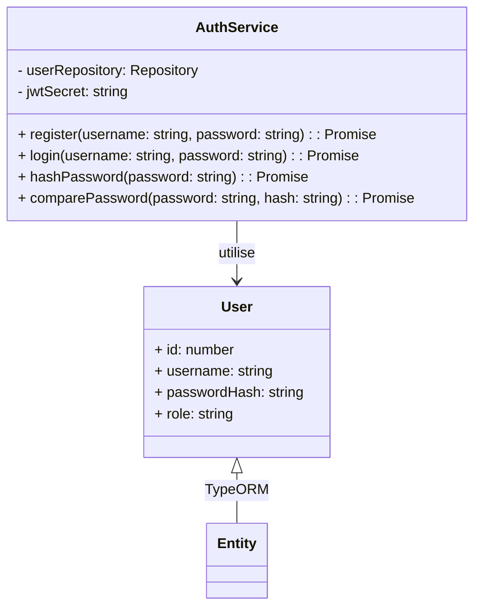

```mermaid 

classDiagram
    class AuthService {
        - userRepository: Repository<User>
        - jwtSecret: string
        + register(username: string, password: string): Promise<User>
        + login(username: string, password: string): Promise<string>
        + hashPassword(password: string): Promise<string>
        + comparePassword(password: string, hash: string): Promise<boolean>
    }
    class User {
        + id: number
        + username: string
        + passwordHash: string
        + role: string
    }
    AuthService --> User : utilise
    User <|-- Entity : TypeORM
```