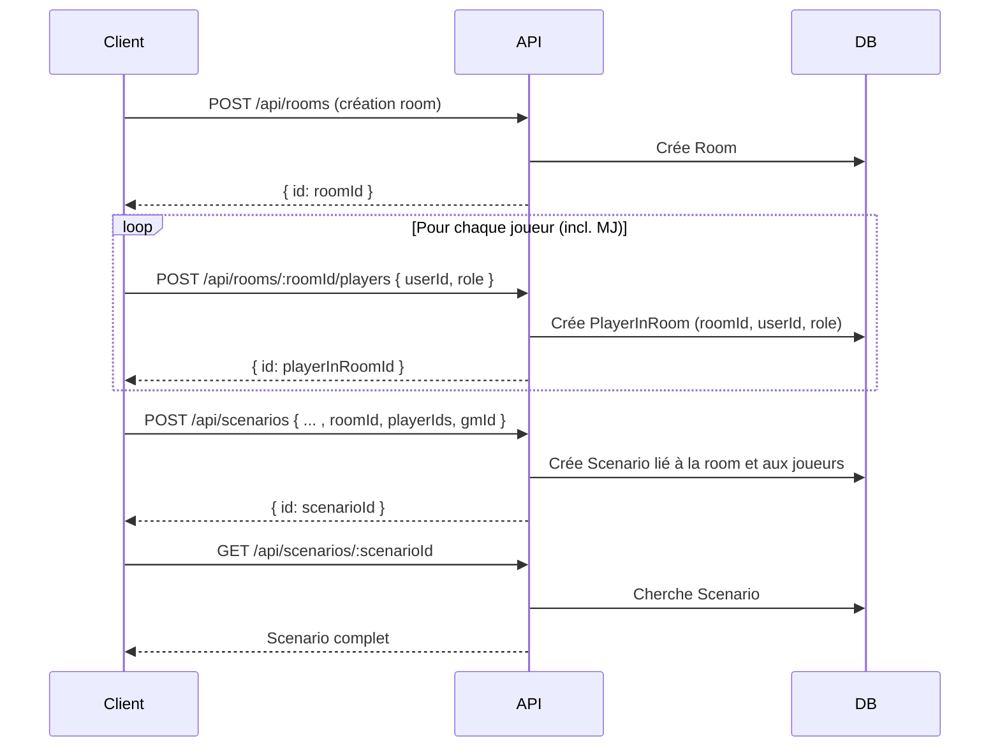

# Design API REST : gestion des joueurs dans une room

**Endpoints à prévoir :**
- POST `/api/rooms` : crée une room
- POST `/api/rooms/:roomId/players` : ajoute un joueur (ou MJ) dans la room (persisté dans PlayerInRoom)
- POST `/api/scenarios` : crée un scénario lié à la room et aux joueurs
- GET `/api/scenarios/:id` : récupère le scénario

**Avantages :**
- Séparation claire entre gestion des rooms et des joueurs
- Facile à automatiser et à tester
- Extensible (retrait de joueur, changement de rôle, etc.)
